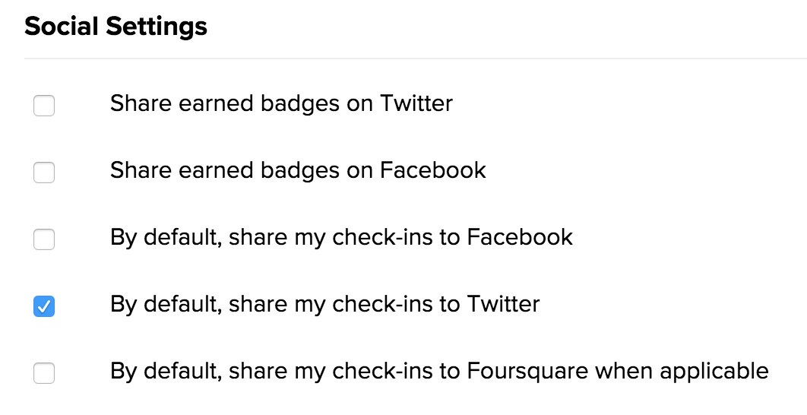

## Project Objective/Ideas


Untappd has some usage restrictions for their [API](https://untappd.com/api/register), so I'm going to explore tweets of beer and brewery check-ins.

**Potential ideas**:
- Exploratory data analysis
- Use tidygraph to create a network visualization to understand the types of beer Untappd users are trying
- Build an image classifier based on appended visuals of beer to guess the SRM ([Standard Reference Method](http://www.twobeerdudes.com/beer/srm))

### Resources

- http://rtweet.info/
- https://github.com/thomasp85/tidygraph
- https://untappd.com/user/jasdumas
- http://eriqande.github.io/rep-res-web/lectures/making-maps-with-R.html
- https://www.thrillist.com/drink/nation/the-16-best-breweries-in-the-northeast

## Analysis

```{r setup, include=FALSE}
knitr::opts_chunk$set(
	echo = TRUE,
	message = FALSE,
	warning = FALSE
)
```

```{r}
library(tidyverse)
library(rtweet)
library(stringr)
library(wesanderson)
library(maps)
```

All (to leverage the `rtweet` package this is my assumption) social media shares from the Untappd app include thier own short url **'untp.beer'**
```{r}
untp <- search_tweets("untp.beer", 
                      n = 18000, 
                      include_rts = FALSE, 
                      retryonratelimit = TRUE,  
                      geocode = lookup_coords("usa"), 
                      lang = "en"
)
```


```{r}
head(untp$text)
```

#### How many unique users are in the dataset?
```{r}
length(unique(untp$user_id))
```


There a few different types of tweet structures that can be shared from the Untappd app:

1. Earning Badges (i.e. tweets that contain 'I just earned the...' or even the word 'badge')
2. Added review text (i.e. text which ends in a '-' before the default template of 'Drinking a')
3. Default check-ins (i.e. tweets that begin with 'Drinking ' _a|an|the_)
4. Brewery offer updates (i.e. tweets that begin with 'Just added ...')

There are granular account social settings available that enable the ease of sharing check-in info to certain linked social media accounts.



I'm going to detect the string patterns and create a new column in the data set to house them.
```{r}
untp$structure_type <- NA

# earning badges
untp$structure_type[untp$text %>% str_detect("I just earned the")] <- "badge achievement"
# default checkin
untp$structure_type[untp$text %>% str_detect("^Drinking ")] <- "default check-in"
# brewery updates
untp$structure_type[untp$text %>% str_detect("^Just added")] <- "brewery update"
# any NA's left should be tweets that users have added additional text/descriptions
untp$structure_type[is.na(untp$structure_type)] <- "additional review"
```

#### How many types of these check-ins are shared?
```{r}
untp %>% group_by(structure_type) %>% 
         summarise(n = n()) %>% 
         mutate(structure_type = fct_reorder(structure_type, n)) %>%
    ggplot(., aes(x = structure_type, y = n)) +
      geom_bar(stat = "identity", fill = wes_palette("BottleRocket1", 1)) +
      theme_minimal() +
      labs(title = "Count of Tweet Types for Untappd Twitter Shares", 
           subtitle = "Most users have shared their badge acheivements.\nGiven that a single check-in can result in multiple badges, this makes sense", y = "Count of Tweets", x = "")
```


#### What kind of badges are users earning?

The 'Brew Bowl LII' badge is the most popular earned badge available during this Superbowl weekend. Consequently, I visited a brewery this weekend and earned this badge. 

<blockquote class="twitter-tweet" data-lang="en"><p lang="en" dir="ltr">Drinking a Golden Messenger by <a href="https://twitter.com/HogRiverBrewing?ref_src=twsrc%5Etfw">@HogRiverBrewing</a> at <a href="https://twitter.com/HogRiverBrewing?ref_src=twsrc%5Etfw">@hogriverbrewing</a> — <a href="https://t.co/70GqltpVXP">https://t.co/70GqltpVXP</a> <a href="https://twitter.com/hashtag/photo?src=hash&amp;ref_src=twsrc%5Etfw">#photo</a></p>&mdash; Jasmine Dumas (@jasdumas) <a href="https://twitter.com/jasdumas/status/959878581936586753?ref_src=twsrc%5Etfw">February 3, 2018</a></blockquote>
<script async src="https://platform.twitter.com/widgets.js" charset="utf-8"></script>


```{r}
untp$badge_type <- NA
untp$badge_type <- str_extract(untp$text, "(?<=').*?(?=')")
```

```{r}
untp %>% group_by(badge_type) %>% 
         summarise(n = n()) %>% 
         dplyr::filter(!is.na(badge_type)) %>% 
         arrange(desc(n)) %>% 
         top_n(25) %>% 
         mutate(badge_type = fct_reorder(badge_type, n)) %>%
   mutate(structure_type = fct_reorder(badge_type, n)) %>%
    ggplot(., aes(x = badge_type, y = n)) +
      geom_bar(stat = "identity", fill = wes_palette("GrandBudapest1", 1)) +
      theme_minimal() +
      coord_flip() +
      labs(title = "Count of Badge Types for Untappd Twitter Shares", 
           subtitle = "", y = "Count of Tweets", x = "")
```


#### Where do people check-in at?

Lot's of activity on the east coast (Boston, MA being the top place at the time of running this analysis) and in the metros across the U.S.! Untappd is based in North Carolina, so it's interesting to not see a lot of activity, but user can have their location settings turned off for privacy in Twitter. Also that may be indictive of users not filling out all the check-in details such as purchase or drinking location. Often times users seem to be drinking and checking-in at home and may want to mask their location then.

```{r message=FALSE, warning=FALSE}
untp %>% group_by(place_full_name) %>% 
  summarise(n = n()) %>% 
  arrange(desc(n)) %>% 
  top_n(11) %>% 
  data.frame()
```


```{r}
## create lat/lng variables using all available tweet and profile geo-location data
untp <- lat_lng(untp)

## plot state boundaries
par(mar = c(0, 0, 0, 0))
maps::map("state", lwd = .25)

## plot lat and lng points onto state map
with(untp, points(lng, lat, pch = 20, cex = .75, col = rgb(0, .3, .7, .75)))
```


.
.
.
```{r}
#write_as_csv(untp, "untp_data.csv")
#untp <- read_csv("untp_data.csv")
```

---
fin.